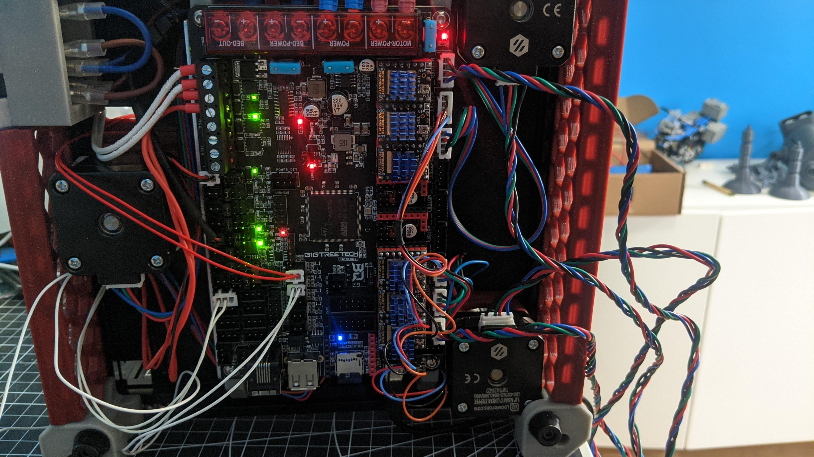
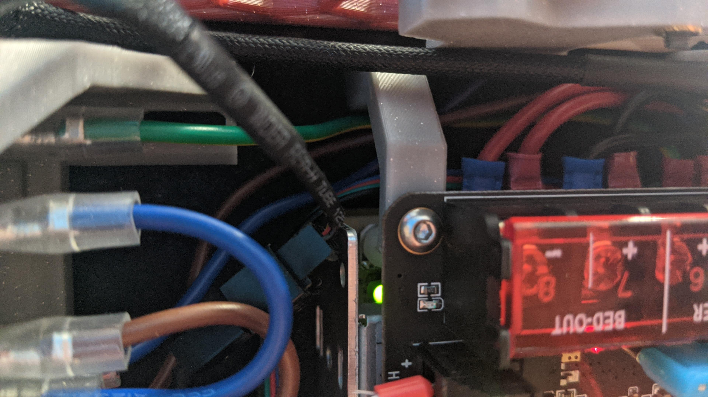

# Crucible BTT Octopus Mounts

simple brackets to support mounting the BTT octopus Below the power supply (used with my [LRS-150 deck panel mount](../lrs-150-deck-panel/))

Print 4 of these. 

Requires 4 m3 heatset inserts to mount octopus to brackets, and 4 m3x8 BHCS to mount brackets to frame.

Pictures from my WIP Crucible

