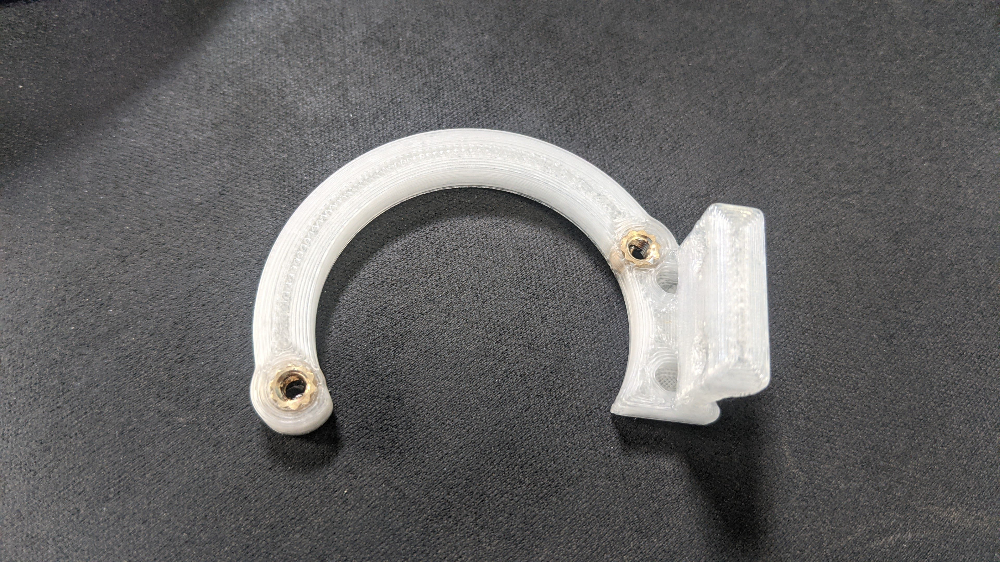
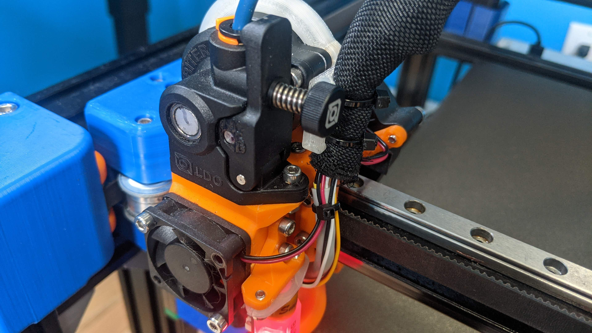
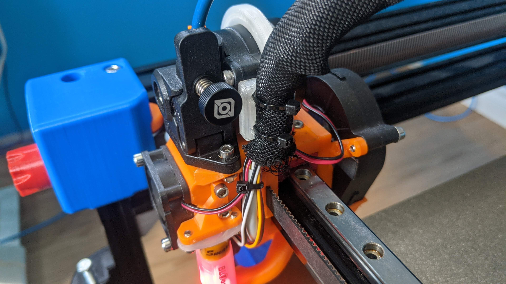
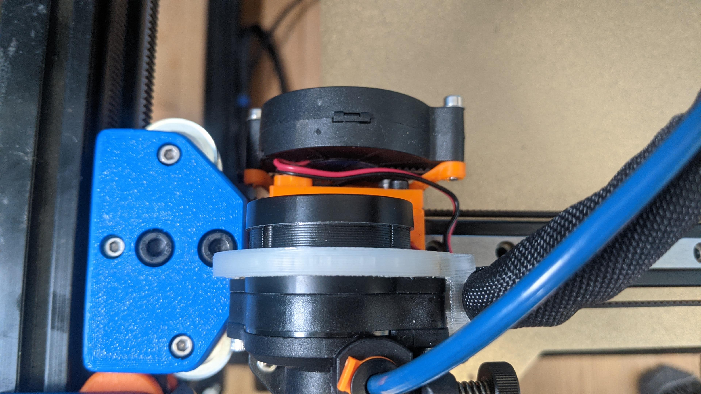

# Orbiter Strain Relief

I needed a simple option for strain relief on my custom print head using an Orbiter v2 extruder on my BLV MGN Cube and this is what a few minutes of CAD got me.









## BOM
```
M3 Heatset Insert [x2]
```

## Printing
Print should be oriented the right way. Infill/walls probably not too important as long as it is strong enough. I did 40% infill with 2mm thick walls and top/bottom. I printed out of PLA since I don't really need high temperature resistance for this printer. ABS or PETG would work well too if you have an enclosed printer.

## Assembly
Press heatset inserts into bracket

Feed zip ties through holes (easier to do before screwing on)

Loosen Orbiter stepper motor M3 bolts until they don't stick out past the motor

Hold bracket against back of motor and re-tighten bolts

Strap wires in

